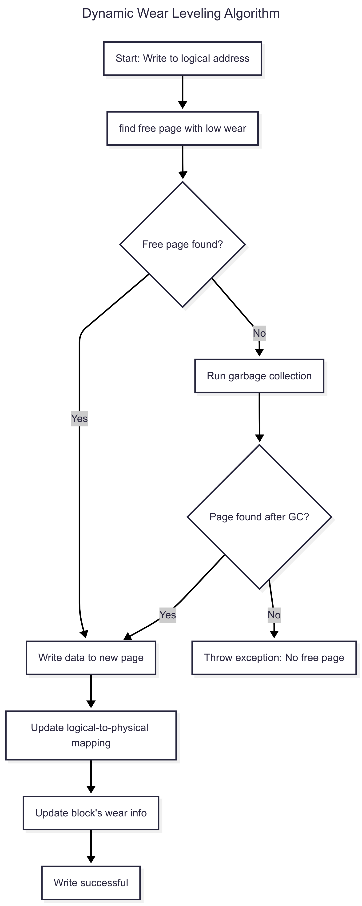
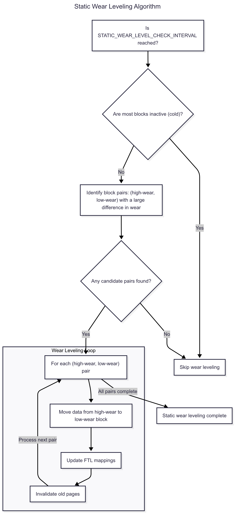

# Wear Leveling Simulator

> WARNING: This code is not fully functional yet. It needs debugging. That being said, the architecture of the simulator is there and it can still be run.

Contact: aniketpach@gmail.com  

---

## Project Description
This project is a simulator to visualize the effect of a Wear Leveling Algorithm on the lifetime of a Flash Memory device. It considers a P/E cycle threshold, above which pages of memory are considered to be bad (which I call "dead pages").

The simulator takes as inputs from the user the memory architecture, P/E cycle threshold, and various other parameters which affect the algorithm.
The simulator produces as an output two graphs, which plot how the number of "dead" pages evolve as time, with and without the Wear Leveling algorithm.

---

## How to Use

### Prerequisites

After having cloned the repository, ensure the requirements are installed. We use numpy and matplotlib.

    ```bash
    pip install -r requirements.txt
    ```

### Running the Simulator

```bash
    python simulation.py
    ```

The variables used to define the memory architecture, max P/E cycle threshold, and algorithm-specific parameters can be modified in config.py. Note that the runtime of the simulator strongly depends upon how large these constants are.

Upon completion, the simulator will save the output graph in .png format, comparing the wear with and without the wear leveling algorithm.

---

## Simulator Architecture
The architecture of the simulator itself is divided into multiple layers of abstraction, in descending order:

#### 1. wear_leveling.py - This is the static wear leveling algorithm. The dynamic wear leveling algorithm is implemented in ftl.py because it reduces complexity and inter-dependencies in the code.

#### 2. ftl.py - This is the FTL (Flash Translation Layer). It also contains the dynamic wear leveling algorithm.

#### 3. flash_memory.py - This represents the hardware itself, such as pages and blocks, and the operations that are performed at a hardware level.

Here's what the other files do:

- **config.py** houses all the global variables that represent the various thresholds and parameters to be defined as user inputs.
- **workload_generator.py** is to generate a stream of operations that the memory must perform, like what a Flash memory controller in a processor would take as an input. Note that this file is a placeholder for now. I do not know how the actual workload of a Flash memory device might look like, and I wish to find out so that I can implement it. Please email me if you can help with this.
- **simulation.py** is where the actual simulation is run, and is the entry point to the simulator. It houses the main function.

---

## Wear Leveling Algorithm

### Dynamic Wear Leveling Algorithm


### Static Wear Leveling Algorithm


---

## Additional Notes
The code is commented and documented, for my own reference.

Any suggestions or constructive criticism are most welcome.
